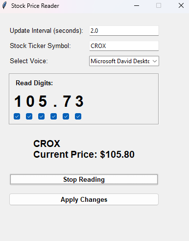

# TTS Stock Price Reader

Simple GUI application that fetches and audibly reads the current price of a stock ticker by TTS.

## How to Run (Executable - Windows)

1.  [Download](https://github.com/swxk19/AudioStockPrice/releases/download/1.0/stock_readout.exe) the `stock_readout.exe` file from releases.
2.  Double-click the `stock_readout.exe` file to run the application.

## Usage

1.  Enter the stock ticker symbol in the "Stock Ticker Symbol" field.
2.  Set the desired update interval in the "Update Interval (seconds)" field.
3.  Choose a voice from the "Select Voice" dropdown.
4.  Tick the checkboxes next to the digits you want to be read aloud.
5.  Click "Apply Changes" to use the entered ticker and interval.
6.  Click "Start Reading" to begin the continuous fetching and reading of the stock price. Click "Stop Reading" to halt this process.

## Notes

* The application fetches stock data from Yahoo Finance. The availability and format of this data are subject to change.
* Text-to-speech voice availability depends on your operating system and installed voices.
